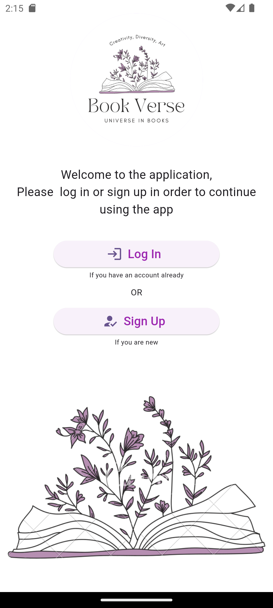
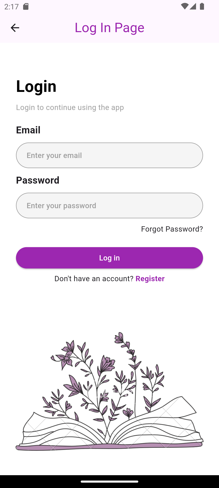
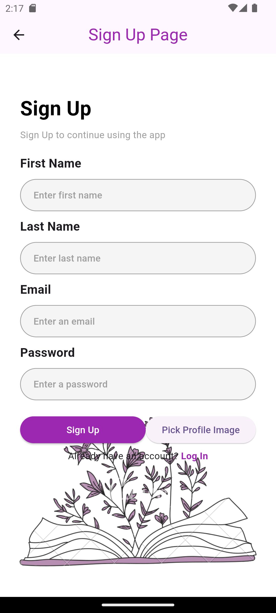
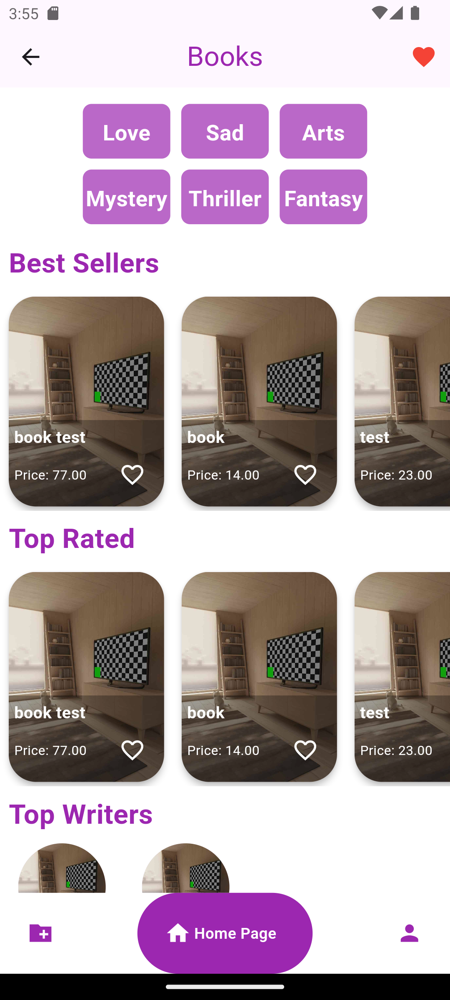
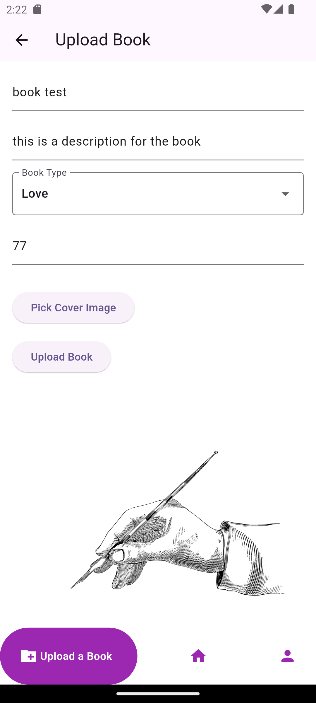
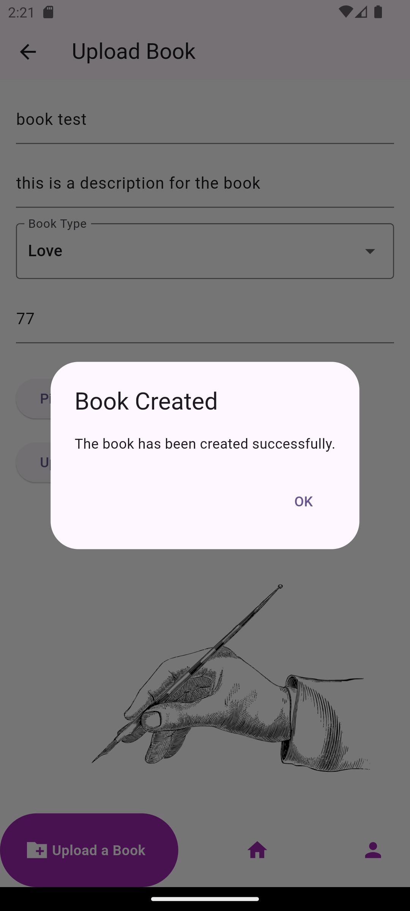
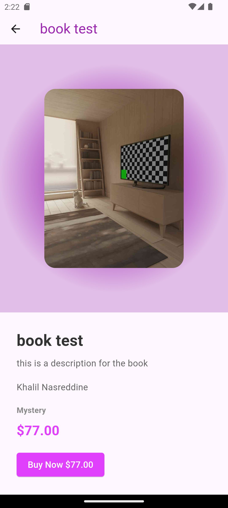
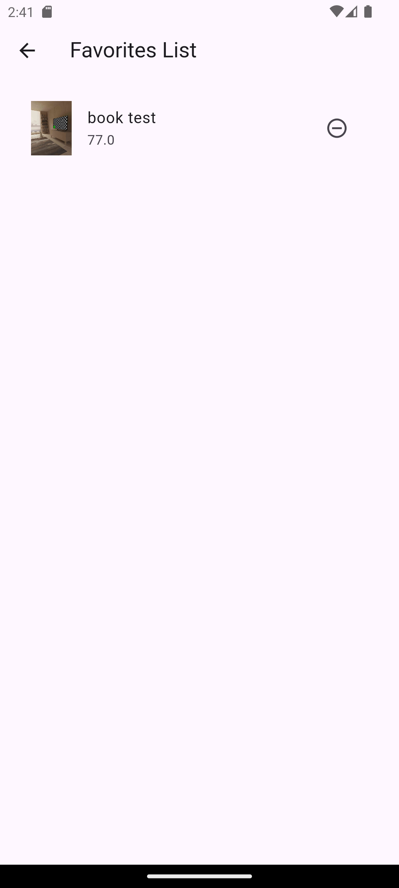
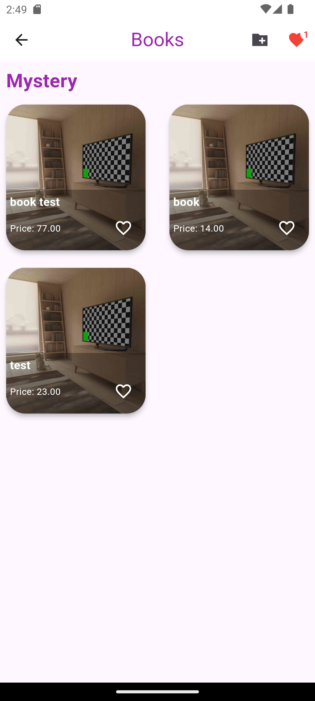
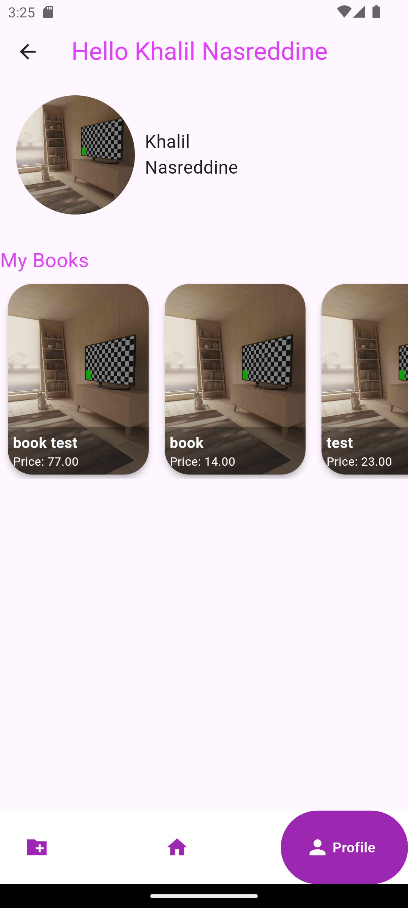

# isdfinal

A new Flutter project.

The project is a publishing library
It is just like any library it has a database of books that users can download either for free or 
for a specific price.
But what differs is that user can also publish books, for free or using a paid plan in which we 
have a professional team of proofreaders and masters in the languages we provide to help him in 
case there are logical or grammatical errors.
So, first we have the main page and the user can login or register:

and if we press on the login it will take us to login page where a user enters email and password,
and if we press on register it will take us to register page where a user enter name, email,
password, and a profile picture.

after register, the user is sent again to login, and after checking from the credentials if true,
it takes the user to home page:

it shows top rated books and best sellers and top authors
and the icon down to the left takes the user to upload page:

and if the user hold on a book a details page is opened:

and if the user taps the favorites icon it will change to a filled heart with and the icon on top 
will have the count, and when the user taps on the icon on top it takes to favorites page:

and when the user taps on one of the buttons on top with the type, it takes us to a page 
showing the books of this type:

and the profile page shows the name, profile images, and books uploaded by the user

